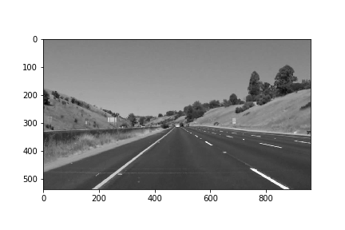
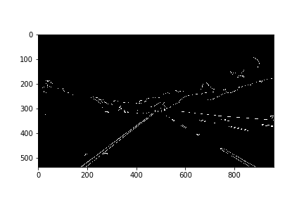
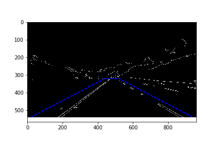
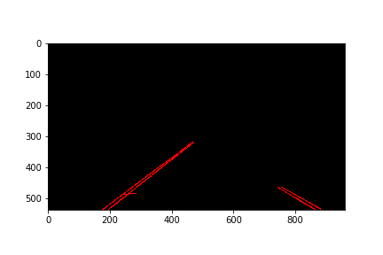
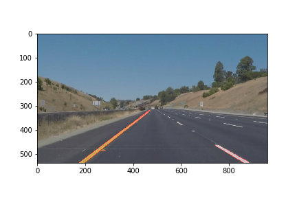
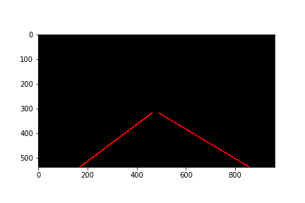
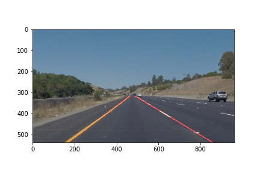

# Prject 1: Finding Lane Lines on the Road

### Project goal
The goal of this project is to detect the lane lines on a video stream  captrued by a front-mounted camera, and produce annotated video with marked lane lines as output.

### Lane line detection pipeline
The detailed lane line detection pipeline for single frame image is described as below. The image 'whiteCarLaneSwitch.jpg' is used as an example to show the outcomes of each pipeline step. The original image is shown below for reference:

##### 1. Convert RBG image to gray image

##### 2. Use Gaussian bluring filter to remove high frequency noise. 
the kernel size is set to 5 for Gaussian filter

##### 3. Detect the edges with Canny edge detector.
The parameters are set to `low_threshold =  100`and `high_threshold = 150`. In Canny detector, any intensity gradient higher than `high_threshold` will be considered as an **edge** in all conditions, while any intensity gradient lower than `low_threshold` will be considered as a **non-edge**. For values falling in between will be classified based on their connectivity.  In general, threshold too high may cause missing edges, and threshold too low will create 'noisy' edges

##### 4. Define region of interest for line detection. 
The region has to be selected carefully to cover the lane line with some tolerance, and to exclude the edges from elsewhere, such as side walk and trees. Based on experiments with example images (pixel 960x540), the vertices of region of interest is set to `[(20, 540), (440, 320), (520, 320), (940, 540)]`. 

##### 5. Apply Hough transform to identify straight lines. 
The following parameters are set for Hough transform. 
`rho = 2` # distance resolution in pixels of the Hough grid
`theta = np.pi/180` # angular resolution in radians of the Hough grid
`threshold = 15`     # minimum number of votes (intersections in Hough grid cell)
`min_line_len = 40` #minimum number of pixels making up a line
`max_line_gap = 20`    # maximum gap in pixels between connectable line segments
Hough transfrom gives several segmented lines, by providing coordinates of both ends. The raw segmented lines are shown below.

##### 6. Add extracted lane lines onto initial image, shown as below:


### Improvement: Solid Lane Mark Identification
In order to generate a single solid line out of the raw segmented lines for each lane mark (left and right), a few processing steps are added in the function `draw_lines()`
##### 1. Calculate the slope **_m_** and offset **_b_** for each line segement, based on $$y = mx + b$$
##### 2. Reject lines with improper slopes. 
Based on the image experiment, the slope is around **-0.75+/-0.5** for left lane, and **+0.6+/-0.5** for right lane. So only those satisfying `0.85 < m < -0.65` are accepted as left lane group, and those satisfying `0.5 < m < 0.7` are accepted as right lane group
##### 3. Further reject slope outliers. 
For each lane group, average **MEAN** and standard deviation **STD** is calculated for slope, and line segements whose slope is more than 2x**STD** away from **MEAN** are treated as outliers and further rejected
##### 4. Average the slope and offset for each gourp. 
The segemented lines remaining in both lane groups are fairly concentrated in term of slope, and  averaging is required to extract a single slope and offset. The plain averaging function could work, but would not be optimum.
$$m_{AVG}=\frac{1}{N}\sum_{i=0}^{N-1}m_i$$
Consider the scenario that in one group there is a long line indicating the solid lane line, and a few very short segmented lines coming from small objects on the road. However, with plain averaging, the long line only stands for one sample, and the short lines contributes more. Therefore, the averaging results tends to be off from the actual lane. Instead, a weighted averaging method is used in this project, by taking into account the length of each line. The equation is shown below:
$$m_{AVG}=\frac{1}{\sum_{i=0}^{N-1}l_i}\sum_{i=0}^{N-1}m_il_i$$
$$l_{i}=\sqrt{(x_{i1}-x_{i2})^2+(y_{i1}-y_{i2})^2}$$
In this equation, longer line weights more, and shorter line weights less. 
##### 5. Extrapolate the lane line. 
After the averaged slope **_m_** and offset **_b_** are extraced, a solid line will be drawn to reach the entire lane. Currently, the lane range is defined from `y = 540` (bottom of the image) to `y = 320` (limit of region of interest). `x` can be calculated accordingly
$$x=\frac{y-b_{AVG}}{m_{AVG}}$$
After averaging and extrapolation, a solid line can be drawn for each lane group, shown as below

Further add the extracted solid lane line onto initial image, shown as below:


### Verification on Video Stream
The detection method described above is further applied to the video stream samples, 'solidWhiteRight.mp4' and 'solidYellowLeft.mp4'. The solid lane lines are identified successfully in almost every single frame.

### Shortcomes and Potential Improvement
The proposed detection algorithm has a few shortcomes at this moment, mostly related to fixed parameters pre-set *manually* based on a few experiments. Potential improvement can be done by set those parameters adaptively, according to the image itself.
##### 1. `low_threshold` and `high_threshold` for Canny edge detector. 
Fixed threshold may run into trouble when image exposure varies, such as day-light vs. night-light condition. The exposure of carmera itself will also create large variation on detection threshold. To get better performance, equalizing the image will be required before running Canny detector.
##### 2. Vertices of region of interest. 
It would be better to split the region of interest into two parts, one for the left lane, and the other for the right lane. By doing this, objects between the lane lines, such as another car in front, could be excluded from line detection. 
##### 3. Parameters for Hough transform. 
Fixed parameters are used in this report, but adaptive parameters will work more robust.
##### 4. Parameters for solid line averaging. 
Currently, the valid slope range is manually set to **-0.75+/-0.5** for left lane, and to **+0.6+/-0.5** for right lane. It is possible to use unsupervised learning to divide the raw segmented lines into two clusters without any pre-knowledge on valid slopes.
##### 5. Smoothing across video frames. 
Durning video stream test, for some frame with dashed lines, no left lane or no right lane was detected. Considering the factor that the lane line showning in the video stream is smooth or slow changing over time (frames), based on the those detected in previous frames, lane lines in the next frame can be predicted with a smoothing function. Such smoothing can also help to reject random interferences due to unexpected object on road.
### Extral Challange
The detection method is also tried on the extra challange video, 'challange.mp4'. Since this video has a different image size (pixel 1280x720), instead of (pixel 960x540), a modification has to be made on region of interest defination. ratios to the image size, instead of absolute coordinations are used to define the vertices.
```python
im_xsize = edges.shape[1]
im_ysize = edges.shape[0]
vertices = np.array([[(np.round(20/960*im_xsize), im_ysize), (np.round(440/960*im_xsize), np.round(320/540*im_ysize)), (np.round(520/960*im_xsize), np.round(320/540*im_ysize)), (np.round(940/960*im_xsize), im_ysize)]], dtype=np.int32)
```
A similar modification happens to the lane line extrapolation anchor points. After all, the lane line detection works most of the time for the extra challange video. The lane mark is missed or off for a few frames, mostly due to poor edge detection.

### Summary
A lane line detection pipeline is proposed in this report, and a improved algorithm is used to further extract single lane mark out of raw segmented lines. This method is tested and verified with both static image examples and video stream examples, including the extra challange video, showing successful lane lines detection most of the time.